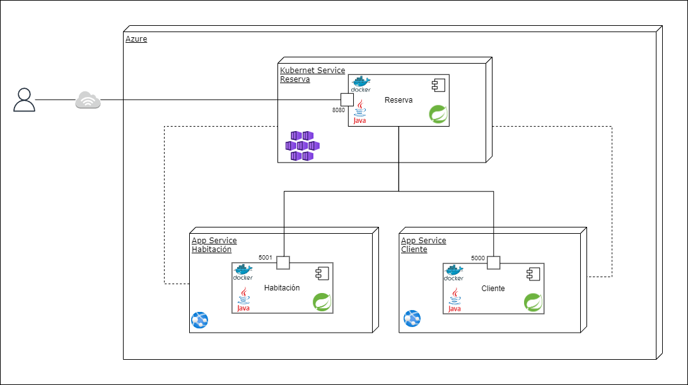

# Clean Arquitectures

## <u>Patrones utilizados</u>

En el desarrollo de los microservicios de cliente, reserva y habitación, se implementaron diversos patrones de diseño que optimizan la estructura y el comportamiento de estas aplicaciones. Los patrones utilizados fueron:

**
1.	Patrones de creación
** 

• ***Factory Method:***  Facilita la creación de objetos de manera flexible y eficiente.

• ***Transfer Object:*** Permite el intercambio de datos de forma simplificada entre componentes del sistema.

**
2.	Patrones de estructura
**

• ***Patrón Repository:*** Centraliza el acceso y manipulación de datos, mejorando la organización y mantenibilidad del código.

**
3.	Patrones de comportamiento
**

• ***Patrón Strategy:*** Permite definir algoritmos intercambiables para resolver una tarea específica, brindando mayor flexibilidad y extensibilidad a la aplicación.

**
4. Patrones de arquitectura
**

• ***Arquitectura Hexagonal:*** Se realizó una separación por capas que permitió una mejor organización del código y una mayor facilidad para realizar cambios y mejoras en cada componente de forma aislada, sin afectar otras partes del sistema.

• ***Microservicios:*** Enfoque arquitectónico principal, que divide la aplicación en componentes independientes y desacoplados, facilitando su escalabilidad y mantenimiento.

• ***Cliente-Servidor:*** Gestiona las interacciones entre los usuarios y los servicios.

• ***Patrón MVC:*** Organiza la estructura de la aplicación en modelos, vistas y controladores, mejorando la separación de responsabilidades y la legibilidad del código.

## <u>Patrones futuros</u>

En busca de mejorar nuestra aplicación, se tuvieron en cuenta algunos patrones que pueden contribuir significativamente en la arquitectura, el rendimiento y la gestión del sistema a medida que avanza en su desarrollo. Llegando así a patrones que nos proporcionen una mayor eficiencia, mantenibilidad e infraestructura más sólida y adaptable.

• ***Patrón CQRS (Command Query Responsibility Segregation):*** Es una opción que se considera para el microservicio de Reserva. Este patrón propone tener dos bases de datos: una para lectura y otra para escritura. Esto permite optimizar el rendimiento al tener una base de datos optimizada para las operaciones de consulta y otra para las operaciones de escritura evitando posibles cuellos de botella en las operaciones.

• ***Patrón de API Gateway:*** Establece un punto de entrada único para comunicar los microservicios de cliente, reserva y habitación. Al usar un API Gateway, podemos centralizar y gestionar de manera más eficiente las solicitudes que llegan a nuestros microservicios, lo que facilita el control de acceso, la seguridad y el monitoreo de las comunicaciones entre los diferentes componentes de la aplicación.