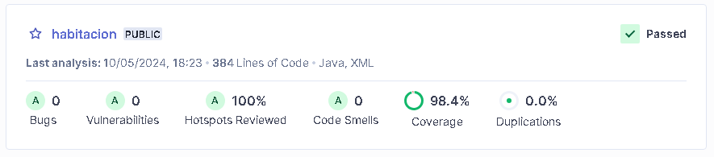
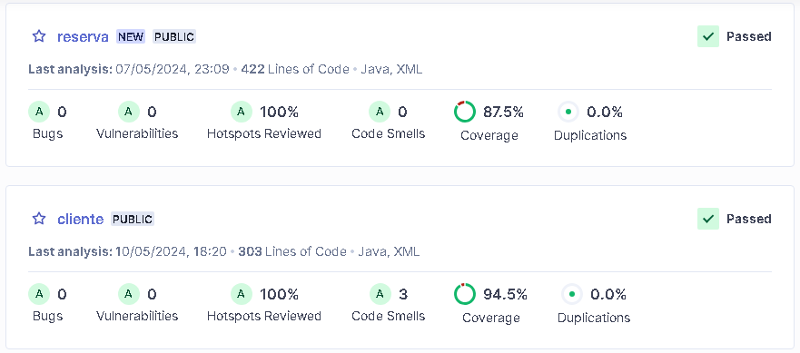

# DevOps

## <u>Repositorio de código</u>

El código fuente del proyecto se encuentra en tres repositorios dentro de la organización [RoomFinder-ARCN](https://github.com/RoomFinder-ARCN) en GitHub, en donde se trabajaron los microservicios de cliente, reserva y habitación.

## <u>Codespace</u>

Se creo un entorno de desarrollo basado en la nube directamente desde los repositorios de GitHub, en donde se puede codificar, compilar, depurar y colaborar directamente desde un navegador web, eliminando la necesidad de configurar manualmente los entornos de desarrollo en las máquinas locales.

Para la creación de los codespace, cada uno de los respositorios de la organización del proyecto cuenta con un archivo devcontainer.json que permite definir y configurar el entorno de desarrollo, la imagen del contenedor, las extensiones, herramientas y dependencias necesarias para su adecuada compilación.

[Configuración devcontainer.json](https://github.com/RoomFinder-ARCN)

    devcontainer.json    # Archivo de configuración

    "name": ...            
        "features": ...      
        "extensions": ...    
        ...

## <u>Análisis estático de código</u>
Con ayuda de SonarCloud se logró la integración continua y el análisis estático de código en donde se obtuvieron métricas de calidad, estadísticas,  porcentajes de cobertura del código, entre otros,  para realizar correcciones de manera temprana y entregar un software más seguro, consistente y mantenible.

