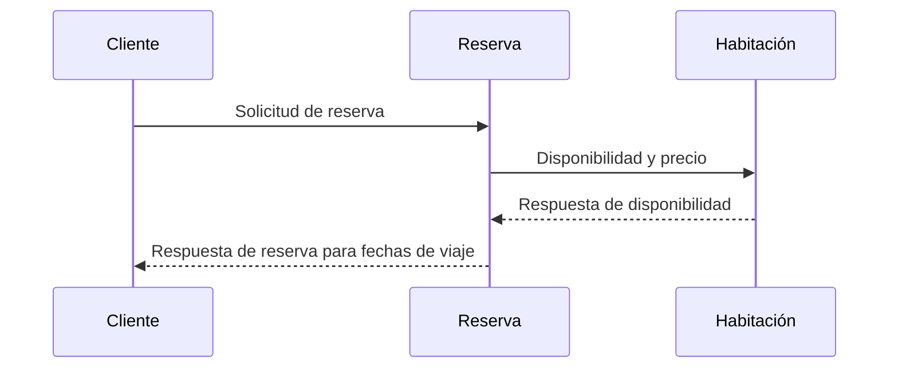

# Domain Driven Design

## <u>Caso de negocio</u>

**Sistema de reservas de habitaciones de hotel:**
Como cliente, quiero poder buscar y reservar habitaciones de hotel disponibles para las fechas de mi viaje y filtrar los resultados por tipo de habitación o precio.

## <u>Dominios</u>
**Actividad para la identificación de dominios:** [Event storming](https://miro.com/app/board/uXjVNjZ6Edk=/)

Para el desarrollo de esta actividad se tuvieron en cuenta:

* Dominios
* Comandos
* Roles
* Reglas de negocio
* Agregados
* Issues
* Sistemas externos

Y finalmente se definieron los dominios como se muestra a continuación:

Cliente      | Habitación    | Reserva 
------------ | ------------- | ------------
Registro e información del cliente | Información por tipos y precios | Busqueda de habitaciones 
Reservas del cliente | Disponibilidad de habitaciones   | Reserva y cancelación

## <u>MVP</u>

> **<a style="color: #2F74C3;">Nota:</a>** Para cada uno de los microservicios se creo un repositorio estructurado de código en donde se encontrarán las entidades, el controlador, los repositorios, las pruebas unitarias y demás clases o configuraciones necesarias para compilar el proyecto. 
